# MolRL-Folding

Reinforcement learning for **DNA origami staple design**: an agent learns to build the staple layout of a target nanostructure, and is rewarded by the robustness of the finished design.

  

<em>One episode (illustrative). 18 staples on a small L-shaped sheet; real designs use roughly 200.</em>

## The task in one paragraph

A DNA origami is built from one long **scaffold** strand (typically ~7,000 nucleotides, e.g. M13mp18) and many short **staples** (typically 30–40 nt) that bind the scaffold at chosen positions and pull distant regions together. Given a target shape and a routed scaffold, the staple layout decides whether the shape forms and how robust it is. Today this layout comes from rule-based design tools plus manual tweaks. Here, an agent places staples one at a time and receives a single reward once the full design is evaluated.

## Research question

> Can an RL agent learn staple-placement policies that produce more robust DNA origami designs than rule-based baselines, and do these policies generalize to target shapes unseen during training?

Sub-questions:

1. **Credit assignment.** With one terminal reward, can learned value estimates of *partial* designs guide staple placement?
2. **Sample efficiency.** Evaluating a design is expensive. How many evaluations are needed to beat the baselines?
3. **Proxy validity.** Do cheap robustness scores agree with higher-fidelity simulation and with published experimental results?
4. **Generalization.** Does a policy trained on some shapes transfer to others?

## Background in five lines

- A **helix** is a stretch of double-stranded DNA. A DNA origami sheet is several helices side by side.
- The **scaffold** snakes through all helices as a single strand, turning around at the ends.
- A **staple** binds the scaffold on one helix, crosses to a neighboring helix at a **crossover**, and binds the scaffold there too.
- Staples hold neighboring helices together, which gives the sheet its rigidity and its shape.
- In the lab all staples are mixed with the scaffold at once and annealed.

## MDP formulation (draft)

| Component | Definition |
|---|---|
| **Fixed per episode** | Target shape (helix grid and lengths), routed scaffold and its base sequence |
| **State** | Target shape, scaffold, staples placed so far (coverage map), action-validity mask |
| **Action** | Place one staple: start, end, and crossover position(s). Discrete and structured, with invalid actions masked (overlaps, lengths out of range, impossible crossovers) |
| **Transition** | Deterministic: the chosen staple is added to the plan |
| **Termination** | The scaffold is fully covered |
| **Truncation** | Step limit (e.g. twice the expected staple count). Handled as truncation, not termination, when bootstrapping values |
| **Reward** | Sparse, terminal: robustness score of the complete design (next section). No intermediate reward in v1 |

The placement order is a *construction order* for the plan, not a physical order. In the tube all staples are present together. An episode therefore produces a complete design, not a sequence of physical steps.

## Measuring robustness (draft)

There is no single standard metric, so the score is built from several levels of fidelity, trading accuracy against cost.

| Level | Method | What it measures | Cost | Role |
|---|---|---|---|---|
| 1. Thermodynamic | Nearest-neighbor models (e.g. NUPACK) | Stability of each staple–scaffold duplex, with emphasis on the weakest link; mis-hybridization between staples | milliseconds | Training reward |
| 2. Coarse mechanical | Tools such as CanDo or mrDNA | Deviation from the target shape, flexibility, and **defect tolerance** (remove random staples, re-evaluate) | seconds to minutes | Training reward or selective evaluation |
| 3. Coarse-grained dynamics | oxDNA | Stability of the simulated structure | hours | Validation of the best designs only |

These scores are **proxies** for experimental yield. Checking how well they track published results is part of the research.

## Methods and baselines

- **Random valid policy**: samples uniformly among unmasked actions.
- **Rule-based heuristic**: fixed staple length and regular crossover spacing, following standard origami design conventions.
- **PPO with action masking**: policy-gradient baseline.
- **Discrete value-based agent with action masking** (e.g. Double DQN). PPO also handles discrete actions, so this comparison is policy-gradient versus value-based.

Metrics: robustness score, defect tolerance, shape deviation, number of evaluations needed to reach a target score, and performance on held-out shapes.

## Scope and assumptions

- **Scaffold routing is fixed** in v1. Learning the routing is a possible extension.
- Targets start as **2D sheets** built from parallel helices. More complex shapes come later.
- This is **not** protein folding and does **not** model kinetic folding pathways. Annealing protocol control is a possible second control problem.
- Robustness scores are computed in silico, and no wet-lab validation is planned.

## Open design decisions

- Action parameterization: one flat discrete index, or an autoregressive choice of start, end, and crossover.
- Reward composition and weighting between levels 1 and 2.
- Whether to allow an explicit stop action that can leave regions uncovered.
- Benchmark shapes and the scaffold sequence.
- Evaluation budget per training run.

## Technologies

- Python
- Gymnasium-style environment (planned)
- RL library to be decided
- Thermodynamic and mechanical evaluation backends to be decided; oxDNA for validation

## Roadmap

- [ ] Define the benchmark: small 2D sheet shapes first, then larger ones
- [ ] Implement the environment: state, action masks, termination and truncation
- [ ] Implement the level-1 (thermodynamic) reward
- [ ] Implement baselines: random valid policy and rule-based heuristic
- [ ] Train PPO with action masking
- [ ] Train a discrete value-based agent
- [ ] Add the level-2 (mechanical) reward and defect-tolerance test
- [ ] Evaluate generalization to held-out shapes
- [ ] Validate the best designs with oxDNA

## Results

Coming soon.